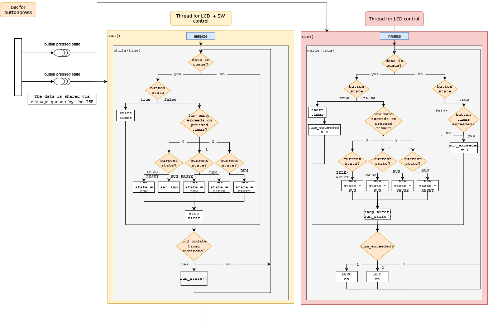

# Assignment 4: Creating a stopwatch using Zephyr RTOS

## A quick intro to the solution

An ISR was attached to sw0. The callback is called on both edges of the button press. When the button is pressed down, the callback puts the button-state (`pressed = true`) in the queues. queue. When sw0 is released again the state (`pressed = false`) is again put into the queues such that each tread can make a decision on what to next given its instructions.

There are two main threads in this program:

- **StopWatchLCD-thread**: Keeps track of the time using timers and makes sure the correct information is displayed at the correct time.
- **Peripheral-thread**: Keeps track of how long the button is/was pushed down and turns LED0 and LED1 on/off according to the instructions.

## The problem to be solved
In this assignment, you will use the LCD module and the user button
  to create a stopwatch using Zephyr.  You can choose however
  you want to implement this stopwatch, be it FSM or just
  task/thread-based mainloops that communicate via whichever
  schemes you deem necessary.  We will use the LEDs to communicate
  additional information as part of the human-machine interface,
  since we only have one button for now.

The general behavior of the stopwatch should be as follows:

1. On initialization (bootup), the LCD should display "Stopwatch Ready" and both of the LEDs should remain lit.
2. When the button is pressed and released within 2 seconds, begin
the stopwatch and display the current stopwatch time as "MM:SS:mm"
(MM is minutes, SS is seconds, mm is milliseconds) on the LCD. 
The LCD should display "MM:SS:mm RUNNING" on the top line.
Update the LCD stopwatch time roughly every 50 milliseconds.
3. While the stopwatch is active, if the button is pressed and 
released within 2 seconds, then you can record the last lap time.
Display the last lap time on the second line. The LCD should 
display "LAP MM:SS:mm" on the second line.
4. While the stopwatch is active, if the button is pressed and held
down for at least 2 seconds, activate one of the LEDs to signal to 
the user that we have held for at least 2 seconds, and enter the 
"paused" stopwatch mode.  Freeze the current stopwatch time. The
LCD should display "MM:SS:mm PAUSED" on the top line.
5. While the stopwatch is inactive, if the button is pressed and held
down for at least 2 seconds, activate one of the LEDs to signal to 
the user that we have held for at least 2 seconds, and resume the 
stopwatch back to the "running" mode.
6. While the stopwatch is active, if the button is pressed and held
down for at least 4 seconds, activate both of the LEDs to signal to 
the user that we have held for at least 4 seconds, and enter the 
"reset" stopwatch mode.

I recommend creating two 16-length arrays (either char arrays
in C or std::array<char, 16> objects in C++) to be the arrays
you display to the LCD so that you can keep track of things easier.
You can use 
[`snprintf()`](https://en.cppreference.com/w/c/io/fprintf)
to help you format your C-string to each array.

**NOTE:** Make sure to explain the synchronization schemes (semaphores,
queues, etc.) between the different elements (such as ISRs/callbacks and threads) of your program design by updating this README or submitting a short description on Canvas.

## Some notes regarding with the FSM-based approach

Zephyr 3.0 and above come with a handy FSM library that makes it
easy to create FSMs in Zephyr, but unfortunately we are stuck with
Zephyr 2.7 for now since it is the long-term support (LTS) version
that comes with PlatformIO.

However, you can choose to use some other library such as [TinyFSM](https://github.com/digint/tinyfsm) or you can make a lightweight
one real quickly using a C++ class, which supports the `std::function<>` type (see [1](https://en.cppreference.com/w/cpp/utility/functional/function), [2](https://www.geeksforgeeks.org/passing-a-function-as-a-parameter-in-cpp/)).

One last thing about the FSM-based approach is that you will
need to be careful with the timing. Having some sleeps on the
order of milliseconds (rather than tens/hundreds of milliseconds)
and checking the current time with the modulo operation is 
probably the way to go, rather than trying to sleep for longer
periods of time.

## Some notes regarding with the non-FSM approach

If you don't want to use a FSM, you can try to use a 
[timer](https://docs.zephyrproject.org/2.7.0/reference/kernel/timing/timers.html) 
if you wish.  I would say that you could probably just do checks
based on the current time from `k_uptime_get_32()` or you can use
another thread that is a timer that sends messages to your
"worker" threads that are doing the actual manipulation of the 
LCD. Think about how you would do it and feel free to spitball some
[sequence diagrams](https://www.uml-diagrams.org/sequence-diagrams.html).
